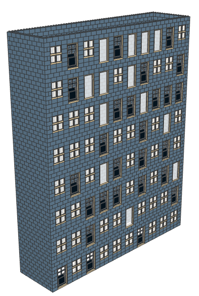

# Procedural Bricks

Procedural generation library for creating Lego models

This project is half-baked, incomplete, and largely abandoned.

You can generate and example structure by running `python3 proceduralbricks/main.py`. This will create a sample LDraw file called `test.ldr` in the current working directory. It will look something like the following:

